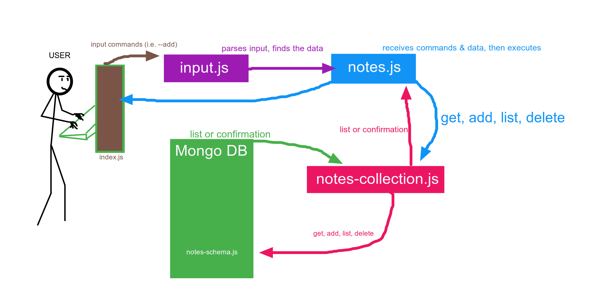

# Notes App Lab - Class 01

## Project: Notesy

This is a terminal based (CLI) application allowing users to easily create and manage a list of categorized notes!

### Author: David Palagashvili / Javascipt 401d36

### Links and Resources

- [submission PR](http://xyz.com)
- [ci/cd](http://xyz.com) (GitHub Actions)
- [back-end server url](http://xyz.com) (when applicable)
- [front-end application](http://xyz.com) (when applicable)

### Setup

#### `.env` requirements (where applicable)

i.e.

- `PORT` - Port Number
- `MONGODB_URI` - URL to the running mongo instance/db

#### Initialization (running the app)

So far, options include: -a , --add

#### How to use your library (where applicable)

#### Tests

- How do you run tests?
- Any tests of note?
- Describe any tests that you did not complete, skipped, etc

#### UML

